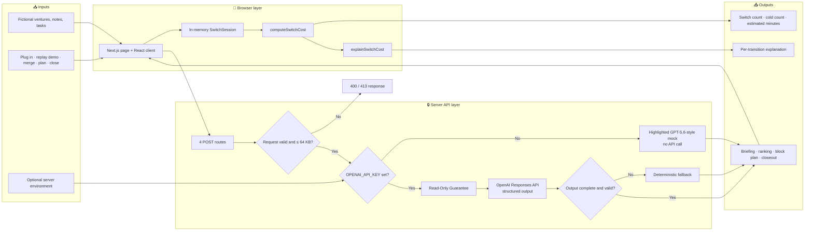

# Switchboard

**A calm command center that makes cross-venture context switching visible, measurable, and easier to plan.**

[](./LICENSE)
[](https://www.typescriptlang.org/)
[](https://nextjs.org/)
[](https://platform.openai.com/docs/api-reference/responses)
[](./SUBMISSION_CANDIDATE.md)

People who operate several ventures rarely have one priority list or one mental context. Switchboard
tracks deliberate transitions between venture lines, estimates a transparent re-orientation budget,
and provides optional read-only AI briefings, rankings, plans, and closeouts. Manoj Mallick built it
for OpenAI Build Week 2026 from the firsthand problem of running multiple ventures at once.

## Table of Contents

- [Why Switchboard](#why-switchboard)
- [Honest Status](#honest-status)
- [Architecture](#architecture)
- [How It Works](#how-it-works)
- [Built with Codex and GPT-5.6](#built-with-codex-and-gpt-56)
- [Quick Start](#quick-start)
- [Configuration](#configuration)
- [Project Structure](#project-structure)
- [Privacy and Data Handling](#privacy-and-data-handling)
- [Roadmap](#roadmap)
- [License](#license)

## Why Switchboard

Most productivity tools flatten unrelated work into one queue. Switchboard keeps venture identity
visible and measures the transitions between those contexts.

| Pain | Switchboard response |
|---|---|
| Separate ventures compete for the same attention | Venture lines show status, latest context, and pending work side by side. |
| Re-entering a venture requires reconstructing context | A structured re-entry briefing returns “since you left,” three priorities, and one focus. |
| Cross-venture switching is easy to overlook | A deterministic estimator records actual venture changes and explains every cost contribution. |
| Unrelated task lists are hard to compare | Priority merge produces one validated ranking, with deterministic deadline ordering as fallback. |
| A fragmented day is hard to redesign | The planner proposes venture blocks, then the application scores both schedules with the same estimator. |
| Workdays end without a clear boundary | Daily closeout reports visited lines, measured switching, remaining work, and a shutdown prompt. |

## Honest Status

Switchboard is a **v0.7.1 submission candidate and functional prototype**.

| Area | Current status |
|---|---|
| Data | Three fictional ventures, notes, and task lists are checked into the repository. |
| Persistence | None. Session events live in React state and reset on reload. The Supabase variables are reserved but unused. |
| Authentication | None. The generated wrapper configuration explicitly sets authentication to `none`. |
| AI | Optional. Without `OPENAI_API_KEY`, every assisted flow returns a clearly labeled, deterministic GPT-5.6-style mock. No provider call is made. |
| Measurement | A product planning model, not a scientific measurement of productivity loss. Assumptions are explicit in code and UI. |
| Demo | A fixed fictional workday can be replayed. Run `pnpm benchmark:switch-cost` to reproduce its result. |
| Release | The `v1.0.0` tag is intentionally blocked until the final live application and public video pass [`RELEASE_V1.md`](./RELEASE_V1.md). |

The checked-in fixture currently computes **6 switches, 2 cold entries, and 74 estimated minutes**.
That number comes from `computeSwitchCost`; it is measured from the fixture, not written as a
performance claim.

## Architecture



All four server routes validate JSON with Zod before provider access. The shared Read-Only
Guarantee permits only `briefing`, `rank`, `plan`, and `narrate`. Priority and planner responses
receive additional completeness and identity checks before the UI accepts them.

## How It Works

1. **Start on one venture line.** `createSwitchSession` records the initial venture and timestamp.
   Selecting the already-active venture adds no event.
2. **Plug into another venture.** `plugIntoVenture` appends one event and the client requests a
   re-entry briefing. A stale-response counter prevents an older briefing from replacing a newer one.
3. **Measure the transition.** `computeSwitchCost` sorts events without mutating the input, ignores
   consecutive same-venture events, and tracks the last touch for each venture.
4. **Classify and explain cost.** A first recorded entry is cold by default. A return is cold only
   when time away is strictly greater than four hours; exactly four hours is warm. The UI shows the
   assumptions, classification reason, contribution sum, and final whole-minute rounding.
5. **Use optional read-only assistance.** The user can merge pending priorities, request a
   lower-switch block plan after at least three measured switches, or close the boards. Each flow
   uses structured output when OpenAI is configured, a highlighted GPT-5.6-style mock when the key
   is absent, and deterministic fallback logic after a real network or provider failure.
6. **Replay the fixture when needed.** “Run demo workday” replays the fixed nine-entry fictional
   event stream through the normal session and measurement code. It does not call OpenAI by itself.

### Measure, do not claim

```bash
# Print the fixed fixture's full SwitchCostResult
pnpm benchmark:switch-cost

# Run lint, TypeScript, tests, and a production build
pnpm verify
```

## Built with Codex and GPT-5.6

### How Codex was used

Codex carried the project from product plan to a deployed submission candidate in one traceable
engineering session. It reviewed the initial idea, split the build into versioned milestones,
implemented each milestone on an issue-linked branch, wrote tests, diagnosed the first CI failure,
prepared release documentation, and deployed the resulting Next.js application. The required
`/feedback` provenance value for that work is:

```text
019f74c9-1371-75a3-976e-45923e093dde
```

Repository-verifiable evidence is collected in [`GPT56_EVIDENCE.md`](./GPT56_EVIDENCE.md).

### Important decisions made with Codex

| Decision | Result in the shipped project |
|---|---|
| Measure the checked-in fixture instead of repeating an aspirational headline | The product reports the fixture's reproducible `6 switches / 2 cold / 74 minutes`. |
| Keep the success metric outside the model | AI may propose a venture order; `computeSwitchCost` validates and scores it locally. |
| Define the four-hour boundary precisely | A return is cold only when time away is strictly greater than four hours. |
| Make every assisted path safe without credentials | Missing credentials select a clearly labeled deterministic mock; provider failures select deterministic fallback logic. |
| Keep AI read-only | The provider boundary permits briefing, ranking, planning, and narration—not task completion, messaging, scheduling, or data mutation. |

### Precise GPT-5.6 contribution

GPT-5.6 in Codex was used for the engineering work captured by the session ID above. Its most
important product contribution was shaping and implementing the **measurement spine**: the
deterministic switch-cost estimator, its edge-case semantics, the fixed workday fixture, the
human-readable `73.8 → 74` explanation, and the rule that AI-generated plans are scored by local
code rather than by the model's own claims. The same session then integrated that spine into the
re-entry, priority, planning, closeout, test, CI, documentation, and deployment flows.

This is separate from runtime model use. The server routes support `OPENAI_MODEL=gpt-5.6-sol`
when a server-side `OPENAI_API_KEY` is configured. The public credential-free demo does **not**
make that API call; it displays conspicuously labeled `GPT-5.6 mock` responses. Those mock
responses are demo fixtures, not evidence of a live GPT-5.6 response.

### Test without rebuilding

Judges can open the deployed sandbox at
[`https://switch-board-vert.vercel.app`](https://switch-board-vert.vercel.app). No account, API
key, test credentials, or local build is required. Click **Run demo workday**, expand **Why 74
estimated minutes?**, then try a venture switch, priority merge, switch-reduction plan, and daily
closeout. Assisted cards are intentionally marked `GPT-5.6 mock` in this credential-free build.

For a local audit, follow [Quick Start](#quick-start), then run `pnpm benchmark:switch-cost` and
`pnpm verify`.

## Quick Start

### Prerequisites

| Tool | Required version |
|---|---|
| Node.js | 24 |
| pnpm | 10; the repository pins `pnpm@10.33.2` |

### Run locally

```bash
git clone https://github.com/manojmallick/switch-board.git
cd switch-board
pnpm install --frozen-lockfile
cp .env.example .env.local
pnpm dev
```

Open [http://localhost:3000](http://localhost:3000). No API key is required for the fictional demo.

### Enable OpenAI-assisted responses

Add a server-side key to `.env.local`, then restart the development server:

```dotenv
OPENAI_API_KEY=your_key_here
OPENAI_MODEL=gpt-5.6-sol
```

Never prefix the API key with `NEXT_PUBLIC_`; that would expose it to browser code.

## Configuration

### Environment variables

| Variable | Default | Purpose |
|---|---:|---|
| `NEXT_PUBLIC_SITE_URL` | `https://example.com` when unset; `.env.example` uses `http://localhost:3000` | Base URL for generated metadata. Set it to the deployed canonical URL in production. |
| `OPENAI_API_KEY` | Unset | Server-only credential for the four optional OpenAI Responses API routes. Unset selects clearly labeled GPT-5.6-style mocks without a provider call. |
| `OPENAI_MODEL` | `gpt-5.6-sol` | Model used by re-entry, priority merge, switch planner, and daily closeout routes. |
| `NEXT_PUBLIC_SUPABASE_URL` | Unset and unused | Reserved for a future persistence milestone. |
| `NEXT_PUBLIC_SUPABASE_ANON_KEY` | Unset and unused | Reserved for a future persistence milestone. |

### Important in-code constants

| Constant or behavior | Default | Purpose |
|---|---:|---|
| Base re-orientation cost | `9` minutes | Cost assigned to a warm transition. |
| Cold multiplier | `2.1×` | Multiplies the base cost for cold entries. |
| Cold threshold | Strictly `> 4` hours | Exactly four hours remains warm. |
| First recorded venture entry | Cold | Applies when the event history has not previously touched the destination venture. |
| Final displayed estimate | `Math.round(total)` | Rounds summed transition contributions to whole minutes. |
| Planner eligibility | At least `3` measured switches | Prevents planning from a baseline with too little switching history. |
| Planner block spacing | `1` hour | Builds deterministic projected events before scoring the proposed block order. |
| API request limit | `64,000` bytes | Rejects oversized AI-route requests with HTTP 413. |
| OpenAI client timeout / retries | `12` seconds / `1` retry | Shared provider-client limits in all four routes. |
| Demo replay interval | `260` ms per entry | Controls the fictional workday replay animation. |
| Release URL timeout | `12` seconds | Limits each public artifact check in `verify:release-artifacts`. |

## Project Structure

```text
switch-board/
├── app/page.tsx                         # Server-rendered shell and portfolio summary
├── app/components/switchboard-client.tsx # Session UI and user-triggered flows
├── app/api/reentry-briefing/route.ts    # Structured briefing or local fallback
├── app/api/priority-merge/route.ts      # Validated cross-venture ranking
├── app/api/switch-plan/route.ts         # Validated block proposal, scored locally
├── app/api/daily-closeout/route.ts      # Structured end-of-day narrative
├── src/logic/switch-cost.ts             # Deterministic estimator and assumptions
├── src/logic/switch-session.ts          # Immutable in-tab session transitions
├── src/logic/measurement-explanation.ts # User-facing evidence derived from results
├── src/logic/demo-ventures.ts           # Checked-in fictional portfolio
├── src/logic/demo-workday.ts            # Fixed fictional event fixture
├── src/logic/read-only-guarantee.ts     # Allowed AI capability boundary
├── src/logic/release-artifacts.ts       # Public live/video URL verifier
├── src/logic/*.test.ts                  # Node test suites for domain logic
├── scripts/simulate-workday.ts          # Reproducible fixture measurement
├── scripts/verify-release-artifacts.ts  # v1.0.0 public-artifact gate CLI
├── lib/seo/                             # Metadata and structured-data helpers
├── SUBMISSION_CANDIDATE.md              # Evidence and manual submission work
├── RELEASE_V1.md                        # Checks required before the v1.0.0 tag
├── vercel.ts                            # Build and static cache configuration
└── package.json                         # Commands and pinned package manager
```

## Privacy and Data Handling

- The public demo uses only fictional records from `src/logic/demo-ventures.ts`.
- Session events remain in browser memory. There is no database write, cookie, user account, or
  persistence layer in the current implementation.
- Without `OPENAI_API_KEY`, assisted flows return deterministic GPT-5.6-style mock envelopes and
  do not contact OpenAI. The UI highlights their source as `GPT-5.6 mock`.
- With `OPENAI_API_KEY`, the selected venture notes/tasks or session summary are sent from the
  browser to the corresponding server route and then to the configured OpenAI model.
- Inputs are size-limited, schema-validated, wrapped as untrusted data, and governed by the
  Read-Only Guarantee. The AI layer has no tools for sending messages, completing tasks,
  scheduling events, or changing venture data.
- Keep real credentials in `.env.local`. Only variables prefixed with `NEXT_PUBLIC_` are intended
  for browser exposure.

Do not replace the fictional fixtures with sensitive business information until authentication,
persistence, access control, retention, and provider-data policies have been designed and reviewed.

## Roadmap

| Item | Grounding |
|---|---|
| Verify the final live URL and public demo video, then prepare v1.0.0 | The implemented release gate and manual checks are documented in `RELEASE_V1.md`. |
| Add authenticated persistence for ventures, notes, tasks, and sessions | Supabase variables are present but explicitly reserved and unused. |
| Make estimator assumptions user-configurable | `SwitchCostAssumptions` is already passed explicitly and returned with each result. |

Roadmap items are not implemented features and have no committed delivery date.

## License

Released under the [MIT License](./LICENSE). Copyright © 2026 Manoj Mallick.
